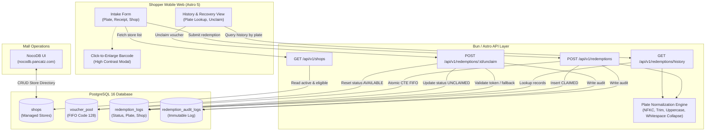
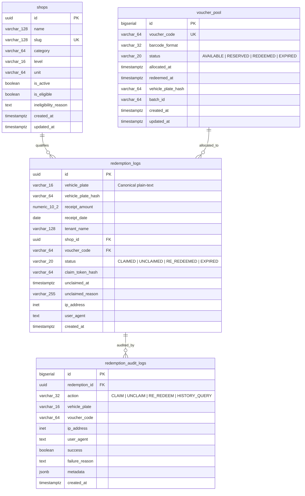
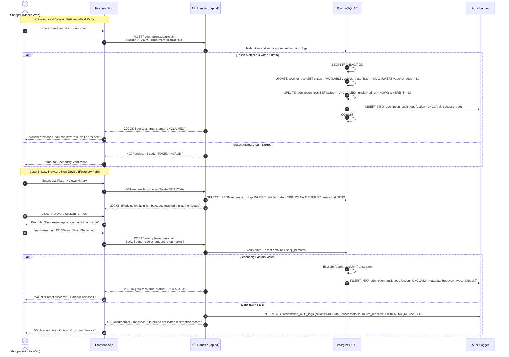
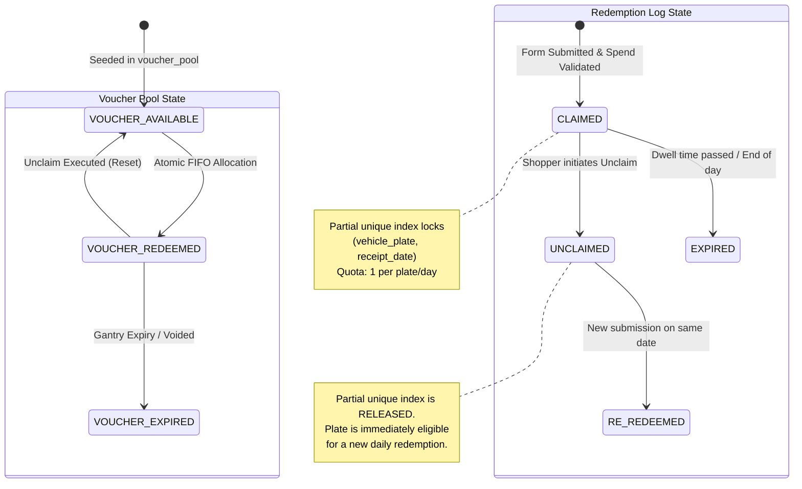

# ADR-001: Plain-Text Plate Normalization, Claim History & Recovery State Machine, and Managed Shop Directory

- **Status:** Accepted
- **Date:** 2026-09-17
- **Authors:** Tech Lead & Solution Architect
- **Context/Initiative:** PAN-75 / PAN-76 (321 Clementi Autonomous Parking Barcode Engine)
- **Target Systems:** Astro 5 Frontend, Bun API Handlers, PostgreSQL 16, NocoDB Admin, n8n Automation Engine

---

## 1. Executive Summary & Verdict

PAN-75 expands the 321 Clementi autonomous parking barcode engine to eliminate user friction and enable self-service recovery. Specifically:
1. **Plain-Text Vehicle Plate Input:** The restrictive LTA MOD-19 checksum validation is replaced with client- and server-side canonicalization (trim, uppercase, collapse internal whitespace, NFKC normalization). This accommodates foreign (e.g., Malaysian), commercial, and non-standard vehicle plates without blocking redemption.
2. **Claim History & Unclaim State Machine:** Redemptions are keyed directly to canonical plate strings. Users who lose their browser session or experience an expired exit countdown can query their claim history and initiate an **Unclaim** action. Unclaiming transitions the voucher back to `AVAILABLE` in `voucher_pool` and sets the redemption status to `UNCLAIMED`, immediately releasing the daily 1-redemption constraint for that vehicle.
3. **Managed Shops Table & Policy:** A normalized `shops` table in PostgreSQL 16 serves as the single source of truth for store selection during intake. Based on the 2026-09-17 mall directory scrape (27 entries):
   - Duplicate `"Carpark"` rows (B1 & B2) are deduplicated.
   - Non-retail facilities (`Carpark`, `Roof top playground`) are excluded from the customer shop selector (`is_active = FALSE`, `is_eligible = FALSE`).
   - Mall-excluded tenants (`Clementi Family & Aesthetic Clinic`, `GynaeMD Women's Clinic`, `Western Union`) are tagged as `is_eligible = FALSE`.
   - The customer endpoint `GET /api/v1/shops` delivers only active, eligible retail tenants (22 stores) by default.
4. **Barcode Click-to-Enlarge:** Purely client-side UI feature requiring zero API modifications. A high-contrast (pure black on pure white) accessible modal provides full-viewport scannability under basement parking lighting.
5. **Security & Anti-Abuse Controls:** To prevent enumeration and voucher theft (unclaiming someone else's voucher by guessing vehicle plates), redemptions issue a cryptographically random `claim_token` stored in the client's `localStorage`. Unclaims without a token require secondary verification (exact receipt spend amount + shop visited). Strict IP rate limiting and an append-only `redemption_audit_logs` table safeguard against brute-force attacks.

---

## 2. Context & Problem Statement

### 2.1 The Friction Points
In the initial release (Phase 1 / PAN-59 / PAN-64):
- **LTA MOD-19 Lockout:** Vehicles with non-standard Singapore plates or Malaysian plates (frequent visitors in west Singapore) were strictly rejected by client-side MOD-19 checksum algorithms.
- **Session Loss & Gantry Expiry:** Shoppers who closed their mobile browser tab or whose 15-minute countdown expired while navigating basement parking had no self-service path to retrieve their barcode or re-claim their daily voucher.
- **Manual Counter Load:** The customer service counter received manual inquiries because tenants were not systematically recorded in the database against redemptions, and voucher recovery was impossible without database administrative intervention.

### 2.2 Constraints & Boundaries
- **PostgreSQL 16 & Bun Stack:** Must maintain sub-5ms transaction latency and compatibility with Bun's native SQL client.
- **NocoDB Administration:** Mall management staff must be able to view, create, and update shops directly through NocoDB without code deployments.
- **Single Daily Quota:** Enforce strictly 1 active redemption per vehicle per calendar day, while cleanly enabling unclaim recovery without race conditions.

---

## 3. Decision Drivers

| ID | Driver | Description |
|---|---|---|
| **DR-01** | **Frictionless Intake** | Allow any legitimate shopper to enter their car plate without format rejections. |
| **DR-02** | **Self-Service Recovery** | Shoppers must be able to recover barcodes or reset daily claims without counter staff. |
| **DR-03** | **Anti-Abuse & Theft Prevention** | Prevent malicious plate enumeration and unauthorized cancellation of active parking vouchers. |
| **DR-04** | **Data Integrity & Concurrency** | Zero race conditions or voucher leakage during concurrent unclaim and re-redemption. |
| **DR-05** | **Zero-Friction DX** | Unambiguous schema DDL and REST contracts for Backend (Stage 2) and Frontend (Stage 3). |

---

## 4. Considered Options & Trade-Offs

### 4.1 Car Plate Storage & Normalization

```
Option A: Hash-Only Storage (HMAC-SHA256)
├── Pros: Maximum PII shielding under strict interpretations of PDPA.
└── Cons: Impossible for shoppers to view their plate in history; NocoDB search is unreadable; cannot support plain-text unclaim queries without client-side hashing secrets.

Option B: Canonical Plain-Text + Salted Hash (Chosen)
├── Pros: Direct plain-text lookup, human-readable audit trail, full NocoDB search, handles international plates.
└── Cons: Stores vehicle plate strings; mitigated by data retention policies (90-day pruning).
```

### 4.2 Unclaim Model & Quota Release

```
Option A: Hard Delete of Redemption Log
├── Pros: Simplest way to release unique constraint `uq_redemption_vehicle_daily`.
└── Cons: Complete loss of audit trail; impossible to detect redemption cycling fraud; violates mall accounting standards.

Option B: State Transition with Partial Unique Index (Chosen)
├── Pros: Preserves full chronological audit history; partial unique index `WHERE status = 'CLAIMED'` automatically releases daily lock; zero data loss.
└── Cons: Requires migration of existing unique index.
```

### 4.3 Voucher Reuse vs. Invalidation on Unclaim

```
Option A: Return Voucher to Pool (`status = 'AVAILABLE'`) (Chosen per PAN-75 spec)
├── Pros: Zero voucher inventory waste; simple FIFO queue recycling.
└── Cons: Re-used voucher code could theoretically be photographed previously; mitigated by 15-minute physical gantry scan window.

Option B: Invalidate Voucher (`status = 'CANCELLED'`) and Issue New on Re-Redeem
├── Pros: Prevents any physical ticket reuse.
└── Cons: Burns through voucher code inventory rapidly during peak testing or accidental double-clicks.
```

---

## 5. System Architecture & Visualizations

### 5.1 Component Topology & Data Flow



### 5.2 Entity Relationship Diagram (ERD)



### 5.3 Sequence Interaction: Unclaim & Recovery Flow



### 5.4 Voucher & Redemption Lifecycle State Machine



---

## 6. Detailed Technical Specifications

### 6.1 Shops Schema & Inclusion/Deduplication Policy

#### 6.1.1 Database DDL (`migrations/0002_create_shops_and_unclaim_support.up.sql`)
```sql
-- Migration: 0002_create_shops_and_unclaim_support
-- Initiative: PAN-75 / PAN-76

-- 1. Create Shops Table
CREATE TABLE IF NOT EXISTS shops (
    id UUID PRIMARY KEY DEFAULT gen_random_uuid(),
    name VARCHAR(128) NOT NULL,
    slug VARCHAR(128) NOT NULL UNIQUE,
    category VARCHAR(64) NOT NULL,
    level VARCHAR(16) NOT NULL,
    unit VARCHAR(64) NOT NULL,
    is_active BOOLEAN NOT NULL DEFAULT TRUE,
    is_eligible BOOLEAN NOT NULL DEFAULT TRUE,
    ineligibility_reason TEXT,
    created_at TIMESTAMPTZ NOT NULL DEFAULT NOW(),
    updated_at TIMESTAMPTZ NOT NULL DEFAULT NOW()
);

-- Index for customer query performance
CREATE INDEX IF NOT EXISTS idx_shops_active_eligible 
ON shops (is_active, is_eligible);

CREATE INDEX IF NOT EXISTS idx_shops_category 
ON shops (category);

-- 2. Modify Redemption Logs Table
ALTER TABLE redemption_logs 
    ADD COLUMN IF NOT EXISTS vehicle_plate VARCHAR(16),
    ADD COLUMN IF NOT EXISTS shop_id UUID REFERENCES shops(id) ON DELETE SET NULL,
    ADD COLUMN IF NOT EXISTS status VARCHAR(20) NOT NULL DEFAULT 'CLAIMED',
    ADD COLUMN IF NOT EXISTS claim_token_hash VARCHAR(64),
    ADD COLUMN IF NOT EXISTS unclaimed_at TIMESTAMPTZ,
    ADD COLUMN IF NOT EXISTS unclaimed_reason VARCHAR(255),
    ADD CONSTRAINT ck_redemption_logs_status CHECK (
        status IN ('CLAIMED', 'UNCLAIMED', 'RE_REDEEMED', 'EXPIRED')
    );

-- Populate vehicle_plate from existing hash if null (placeholder fallback)
UPDATE redemption_logs 
SET vehicle_plate = 'SG-LEGACY' 
WHERE vehicle_plate IS NULL;

ALTER TABLE redemption_logs 
    ALTER COLUMN vehicle_plate SET NOT NULL;

-- CRUCIAL ARCHITECTURAL CHANGE:
-- Replace the absolute daily unique index with a PARTIAL UNIQUE INDEX.
-- This allows unclaiming an existing redemption and re-redeeming on the same day.
DROP INDEX IF EXISTS uq_redemption_vehicle_daily;

CREATE UNIQUE INDEX uq_redemption_vehicle_daily 
ON redemption_logs (vehicle_plate, receipt_date) 
WHERE status = 'CLAIMED';

-- Fast lookup for car plate history queries
CREATE INDEX IF NOT EXISTS idx_redemption_logs_vehicle_plate 
ON redemption_logs (vehicle_plate);

CREATE INDEX IF NOT EXISTS idx_redemption_logs_shop_id 
ON redemption_logs (shop_id);

CREATE INDEX IF NOT EXISTS idx_redemption_logs_status 
ON redemption_logs (status);

-- 3. Create Immutable Audit Trail Table
CREATE TABLE IF NOT EXISTS redemption_audit_logs (
    id BIGSERIAL PRIMARY KEY,
    redemption_id UUID REFERENCES redemption_logs(id) ON DELETE CASCADE,
    action VARCHAR(32) NOT NULL, -- 'CLAIM', 'UNCLAIM', 'RE_REDEEM', 'HISTORY_QUERY'
    vehicle_plate VARCHAR(16) NOT NULL,
    voucher_code VARCHAR(64),
    ip_address INET,
    user_agent TEXT,
    success BOOLEAN NOT NULL DEFAULT TRUE,
    failure_reason TEXT,
    metadata JSONB DEFAULT '{}'::jsonb,
    created_at TIMESTAMPTZ NOT NULL DEFAULT NOW()
);

CREATE INDEX IF NOT EXISTS idx_audit_logs_plate 
ON redemption_audit_logs (vehicle_plate);

CREATE INDEX IF NOT EXISTS idx_audit_logs_action 
ON redemption_audit_logs (action);

CREATE INDEX IF NOT EXISTS idx_audit_logs_created_at 
ON redemption_audit_logs (created_at DESC);
```

#### 6.1.2 Deduplication & Inclusion Policy (Directory Analysis)
The 27 scraped entries from `https://321clementi.com.sg/mobile/stores.aspx` are categorized and filtered as follows:

| # | Store Name | Category | Level | Unit | Active | Eligible | Policy & Justification |
|---|---|---|---|---|---|---|---|
| 1 | AGrader Learning Centre | Learn | L3 | #03-02 | `true` | `true` | Standard commercial tenant. |
| 2 | Arch Angel Brow | Services | L1 | #01-06 & #01-08 | `true` | `true` | Standard commercial tenant. |
| 3 | Beauty Full Skin Wellness | Relax | L2 | #02-03 | `true` | `true` | Standard commercial tenant. |
| 4 | Caring Skin | Services | L2 | #02-09 | `true` | `true` | Standard commercial tenant. |
| 5 | **Carpark** (Deduplicated B1/B2) | Services | B1/B2 | B1, B2 | **`false`** | **`false`** | **Facility exclusion.** Merged B1 & B2 duplicate rows into one entry. Excluded from customer shop picker (cannot redeem carpark tickets with carpark receipts). |
| 6 | **Clementi Family & Aesthetic Clinic** | Services | L1 | #01-14/15 | `false` | **`false`** | **Promotion exclusion.** Explicitly excluded by mall policy terms (`RedemptionCard.astro:157`). Excluded from customer dropdown to avoid rejected receipts. |
| 7 | Epic Swim | Learn | L7 | #07-01 | `true` | `true` | Standard commercial tenant. |
| 8 | Global Art | Learn | L1 | #01-02 | `true` | `true` | Standard commercial tenant. |
| 9 | Gofit | Relax | L6 | #06-06/07/08 | `true` | `true` | Standard commercial tenant. |
| 10 | **GynaeMD Women's Clinic** | Services | L1 | #01-05 | `false` | **`false`** | **Promotion exclusion.** Explicitly excluded by mall policy terms. Excluded from customer dropdown. |
| 11 | Huang Tu Di Xi'An Delights | Dine | L2 | #02-08 | `true` | `true` | Standard commercial tenant. |
| 12 | Indian Barber Shop | Services | L1 | #01-K1 | `true` | `true` | Standard commercial tenant. |
| 13 | Ji De Chi | Dine | L2 | #02-01 | `true` | `true` | Standard commercial tenant. |
| 14 | Kumar Mess | Dine | L1 | #01-01 | `true` | `true` | Standard commercial tenant. |
| 15 | OCD Mala Hotpot | Dine | L1 | #01-09,10,11 | `true` | `true` | Standard commercial tenant. |
| 16 | One Spine Chiropractic | Services | L2 | #02-04 | `true` | `true` | Standard commercial tenant. |
| 17 | Q & M Dental Surgery | Services | L2 | #02-02 | `true` | `true` | Standard commercial tenant. |
| 18 | **Roof top playground** | Services | L7 | L7 | **`false`** | **`false`** | **Facility exclusion.** Mall amenity, not a commercial store. |
| 19 | Saizeriya | Dine | L2 | #02-05/06/07 | `true` | `true` | Standard commercial tenant. |
| 20 | Shanghai Tan Pan-Fried Buns | Dine | L1 | #01-12 | `true` | `true` | Standard commercial tenant. |
| 21 | Siam Square Mookata | Dine | L3 | #03-01 | `true` | `true` | Standard commercial tenant. |
| 22 | Spacio TCM Wellness | Services | L1 | #01-03/04 | `true` | `true` | Standard commercial tenant. |
| 23 | Think Academy | Learn | L6 | #06-01..05 | `true` | `true` | Standard commercial tenant. |
| 24 | Wang Learning Centre | Learn | L3 | #03-01A, #03-01B | `true` | `true` | Standard commercial tenant. |
| 25 | **Western Union** | Services | L1 | #01-13 | `false` | **`false`** | **Promotion exclusion.** Remittance / money changer excluded under terms. |
| 26 | Yan's Tomato Hot Pot | Dine | L2 | #02-10 | `true` | `true` | Standard commercial tenant. |

**Net Result:**
- Total distinct database records seeded: **26 entries** (27 scraped rows with duplicate Carpark collapsed).
- Total active qualifying stores visible to shoppers in the dropdown: **22 stores**.
- Non-retail facilities & excluded clinics are preserved in the DB with `is_active = FALSE` or `is_eligible = FALSE` for audit, NocoDB reporting, and OCR fuzzy matching against receipts.

---

### 6.2 Car Plate Normalization Specification

#### 6.2.1 Normalization Algorithm
The plain-text plate string must be converted into a canonical representation identical across all entry points:

```typescript
/**
 * Canonicalizes a vehicle registration number for indexing, deduplication, and lookup.
 * Accepts any alphanumeric plate format (Singapore, Malaysia, commercial, diplomatic).
 */
export function normalizeCarPlate(rawInput: unknown): string {
  if (typeof rawInput !== 'string') {
    throw new Error('PLATE_INVALID_TYPE: Car plate must be a string');
  }

  // 1. Unicode NFKC Normalization (standardizes full-width characters, ligature forms)
  let plate = rawInput.normalize('NFKC').trim();

  // 2. Strip Invisible / Control / Zero-Width Characters
  plate = plate.replace(/[\u200B-\u200D\uFEFF\u0000-\u001F\u007F-\u009F]/g, '');

  // 3. Collapse all consecutive internal whitespace (spaces, tabs, newlines) to a single ASCII space
  plate = plate.replace(/\s+/g, ' ');

  // 4. Uppercase ASCII & Latin characters
  plate = plate.toUpperCase();

  // 5. Length Boundary Guard (2 to 16 characters)
  if (plate.length < 2) {
    throw new Error('PLATE_TOO_SHORT: Car plate must be at least 2 characters');
  }
  if (plate.length > 16) {
    throw new Error('PLATE_TOO_LONG: Car plate cannot exceed 16 characters');
  }

  // 6. Character Whitelist: Letters, numbers, and single internal spaces only
  // Disallows emojis, punctuation, symbols (e.g., dashes, dots), and SQL injection attempts
  if (!/^[A-Z0-9]+( [A-Z0-9]+)*$/.test(plate)) {
    throw new Error('PLATE_INVALID_CHARS: Car plate may only contain letters, numbers, and single internal spaces');
  }

  return plate;
}
```

#### 6.2.2 Canonical Equivalency Test Matrix
| Raw Input | Canonical Key | Result / Status |
|---|---|---|
| `"sba1234a"` | `"SBA1234A"` | Valid (SG) |
| `" SBA 1234 A "` | `"SBA 1234 A"` | Valid (SG spaced) |
| `"sba    1234   a"` | `"SBA 1234 A"` | Valid (Collapsed) |
| `"jqr 1234"` | `"JQR 1234"` | Valid (Malaysia Johor) |
| `"w 1234 a"` | `"W 1234 A"` | Valid (Malaysia KL) |
| `"CD 12 34"` | `"CD 12 34"` | Valid (Diplomatic) |
| `"a"` | `Error: PLATE_TOO_SHORT` | Rejected |
| `"SBA123456789012345"` | `Error: PLATE_TOO_LONG` | Rejected |
| `"SBA-1234-A"` | `Error: PLATE_INVALID_CHARS` | Stripped or rejected |
| `"SBA 🚗 1234"` | `Error: PLATE_INVALID_CHARS` | Rejected (Emoji) |

---

### 6.3 Claim History & Unclaim State Machine

#### 6.3.1 State Definitions
- **`CLAIMED`**: Voucher successfully assigned to plate for the current calendar day. Barcode is active. Counted against daily quota by partial unique index.
- **`UNCLAIMED`**: The voucher has been released back to `voucher_pool` with `status = 'AVAILABLE'`. The redemption log is marked `UNCLAIMED`, releasing the partial unique index. The plate can re-claim immediately.
- **`RE_REDEEMED`**: The plate successfully claimed another voucher on the same date after a prior unclaim.
- **`EXPIRED`**: Dwell time passed without physical gantry exit or calendar day concluded.

#### 6.3.2 Atomic Unclaim CTE Transaction
Unclaiming a voucher must execute in a single atomic database transaction to prevent race conditions:

```sql
WITH target_redemption AS (
    SELECT id, voucher_code, vehicle_plate, status, created_at
    FROM redemption_logs
    WHERE id = $1 -- Redemption UUID
      AND status = 'CLAIMED'
      AND created_at >= NOW() - INTERVAL '2 hours' -- Time-bound recovery window
    FOR UPDATE
),
released_voucher AS (
    UPDATE voucher_pool vp
    SET status = 'AVAILABLE',
        vehicle_plate_hash = NULL,
        allocated_at = NULL,
        redeemed_at = NULL,
        updated_at = NOW()
    FROM target_redemption tr
    WHERE vp.voucher_code = tr.voucher_code
    RETURNING vp.voucher_code
),
updated_log AS (
    UPDATE redemption_logs rl
    SET status = 'UNCLAIMED',
        unclaimed_at = NOW(),
        unclaimed_reason = $2 -- e.g. 'USER_MISSED_EXIT' or 'BROWSER_LOST'
    FROM target_redemption tr
    WHERE rl.id = tr.id
    RETURNING rl.id, rl.vehicle_plate, rl.voucher_code, rl.unclaimed_at
),
audit_entry AS (
    INSERT INTO redemption_audit_logs (
        redemption_id,
        action,
        vehicle_plate,
        voucher_code,
        ip_address,
        user_agent,
        success,
        metadata
    )
    SELECT 
        ul.id,
        'UNCLAIM',
        ul.vehicle_plate,
        ul.voucher_code,
        $3, -- IP
        $4, -- UA
        TRUE,
        $5::jsonb -- Metadata
    FROM updated_log ul
)
SELECT id, vehicle_plate, voucher_code, unclaimed_at 
FROM updated_log;
```

---

### 6.4 Security & Anti-Abuse Specifications

#### 6.4.1 Voucher-Theft Mitigation (Plate Enumeration Vector)
1. **Bearer Claim Token:**
   - When a redemption succeeds, the server generates a 256-bit cryptographically secure token (`claim_token = 'ct_' + crypto.randomBytes(24).toString('hex')`).
   - The token's SHA-256 hash is saved to `redemption_logs.claim_token_hash`.
   - The plain-text token is returned to the client and persisted in `localStorage.setItem('clementi_claim_token_' + plate, claim_token)`.
   - Any unclaim request providing the valid `claim_token` via the `X-Claim-Token` header is authorized immediately.
2. **Secondary Verification Fallback (Lost Browser / Cleared Cache):**
   - If a shopper accesses the portal from a new device or cleared cache, they do not possess the `claim_token`.
   - To unclaim or view active barcode, the caller must supply secondary knowledge factors present only on their physical receipt:
     1. Exact `receipt_amount` (numeric, matching within $0.00).
     2. Selected `shop_id` or `shop_name`.
   - Attackers randomly testing plates cannot know which store was visited and the exact dollar-and-cents spend.
3. **Rate Limiting & Throttling Rules:**
   - `GET /api/v1/redemptions/history`: Max 10 queries per minute per IP address. Max 5 distinct plates per IP per hour (detects scanning).
   - `POST /api/v1/redemptions/:id/unclaim`: Max 3 unclaim attempts per plate per calendar day. Cooldown of 60 seconds between successive unclaim requests.
4. **Audit Trail:**
   - Every lookup, unclaim success, and unclaim failure is logged to `redemption_audit_logs` with client IP and User-Agent.

---

### 6.5 REST API Endpoint Contracts

#### 6.5.1 `GET /api/v1/shops`
Retrieve list of tenant stores for form population.

- **Query Parameters:**
  - `category` (optional, string): Filter by category (`Dine`, `Learn`, `Relax`, `Services`).
  - `eligible_only` (optional, boolean, default `true`): If `true`, returns only active, promotion-eligible stores.
- **Success Response (`200 OK`):**
```json
{
  "success": true,
  "count": 22,
  "data": [
    {
      "id": "7b68a86a-2114-411a-9694-817de207cbb3",
      "name": "Huang Tu Di Xi'An Delights",
      "slug": "huang-tu-di-xi-an-delights",
      "category": "Dine",
      "level": "L2",
      "unit": "#02-08",
      "is_eligible": true
    },
    {
      "id": "8c79b97b-3225-522b-0705-928ef318dcc4",
      "name": "Saizeriya",
      "slug": "saizeriya",
      "category": "Dine",
      "level": "L2",
      "unit": "#02-05/06/07",
      "is_eligible": true
    }
  ]
}
```

---

#### 6.5.2 `POST /api/v1/redemptions` (Intake Submission)
Submit receipt photo, plain-text vehicle plate, and selected shop for voucher allocation.

- **Content-Type:** `multipart/form-data`
- **Form Fields:**
  - `vehiclePlate` (string, required): Plain-text plate (e.g. `SBA 1234 A`).
  - `receipt` (file/blob, required): Compressed receipt JPEG/PNG image.
  - `shopId` (string, required, UUID): ID from `GET /api/v1/shops`.
  - `timestamp` (string, required): ISO-8601 client submission timestamp.
- **Success Response (`201 Created`):**
```json
{
  "success": true,
  "data": {
    "redemption_id": "9b1deb4d-3b7d-4bad-9bdd-2b0d7b3dcb6d",
    "vehicle_plate": "SBA 1234 A",
    "voucher_code": "CLM-98765432",
    "barcode_format": "CODE128",
    "shop_name": "Saizeriya",
    "receipt_amount": 34.50,
    "claim_token": "ct_8f9e0d1c2b3a4f5e6d7c8b9a0f1e2d3c",
    "status": "CLAIMED",
    "expires_at": "2026-09-17T15:15:00.000Z",
    "created_at": "2026-09-17T12:30:00.000Z"
  }
}
```
- **Error Codes:**
  - `400 Bad Request`: `MISSING_SHOP`, `INVALID_PLATE_FORMAT`, `MINIMUM_SPEND_NOT_MET`.
  - `403 Forbidden`: `OFF_OPERATING_HOURS` (outside 12:00–15:00 SGT weekdays).
  - `409 Conflict`: `DAILY_LIMIT_EXCEEDED` (plate already has an active voucher today).
  - `503 Service Unavailable`: `VOUCHER_POOL_EXHAUSTED`.

---

#### 6.5.3 `GET /api/v1/redemptions/history`
Query claim history for a car plate.

- **Query Parameters:**
  - `plate` (string, required): Car plate number (server auto-normalizes).
- **Headers:**
  - `X-Claim-Token` (optional, string): If present, unlocks full barcode display for recent claims.
- **Success Response (`200 OK`):**
```json
{
  "success": true,
  "vehicle_plate": "SBA 1234 A",
  "data": [
    {
      "id": "9b1deb4d-3b7d-4bad-9bdd-2b0d7b3dcb6d",
      "voucher_code": "CLM-98765432",
      "barcode_format": "CODE128",
      "receipt_amount": 34.50,
      "receipt_date": "2026-09-17",
      "shop_name": "Saizeriya",
      "status": "CLAIMED",
      "can_unclaim": true,
      "can_resume": true,
      "expires_at": "2026-09-17T15:15:00.000Z",
      "created_at": "2026-09-17T12:30:00.000Z"
    },
    {
      "id": "1a2b3c4d-5e6f-7a8b-9c0d-1e2f3a4b5c6d",
      "voucher_code": "CLM-11223344",
      "barcode_format": "CODE128",
      "receipt_amount": 42.00,
      "receipt_date": "2026-09-15",
      "shop_name": "Huang Tu Di Xi'An Delights",
      "status": "EXPIRED",
      "can_unclaim": false,
      "can_resume": false,
      "expires_at": "2026-09-15T15:15:00.000Z",
      "created_at": "2026-09-15T13:10:00.000Z"
    }
  ]
}
```

---

#### 6.5.4 `POST /api/v1/redemptions/{id}/unclaim`
Release an active voucher so the user can re-redeem or reset their lost session.

- **Path Parameters:**
  - `id` (string, required, UUID): Redemption Log ID.
- **Headers:**
  - `X-Claim-Token` (optional, string): Bearer claim token for fast 1-click unclaim.
- **Request Body (required if `X-Claim-Token` is absent):**
```json
{
  "vehicle_plate": "SBA 1234 A",
  "receipt_amount": 34.50,
  "shop_id": "8c79b97b-3225-522b-0705-928ef318dcc4",
  "reason": "MISSED_EXIT_WINDOW"
}
```
- **Success Response (`200 OK`):**
```json
{
  "success": true,
  "message": "Voucher successfully unclaimed. Daily redemption limit has been released.",
  "data": {
    "redemption_id": "9b1deb4d-3b7d-4bad-9bdd-2b0d7b3dcb6d",
    "vehicle_plate": "SBA 1234 A",
    "status": "UNCLAIMED",
    "unclaimed_at": "2026-09-17T12:45:00.000Z"
  }
}
```
- **Error Codes:**
  - `401 Unauthorized`: Missing or invalid claim token and verification credentials failed.
  - `404 Not Found`: Redemption record not found.
  - `409 Conflict`: `ALREADY_UNCLAIMED` or `OUTSIDE_UNCLAIM_WINDOW` (redemption older than 2 hours).
  - `429 Too Many Requests`: Exceeded daily unclaim limit (3 attempts per plate / day).

---

#### 6.5.5 Administrative Endpoints (`/api/v1/admin/shops`)
Direct administrative REST interface for managing shops programmatically (mirrors NocoDB capability).

- **Header:** `Authorization: Bearer <ADMIN_API_KEY>` or `X-Admin-Key: <ADMIN_API_KEY>`
- **`POST /api/v1/admin/shops`**: Create a new tenant store.
- **`PATCH /api/v1/admin/shops/{id}`**: Update store details, toggle `is_active` or `is_eligible`.

---

### 6.6 Barcode Click-to-Enlarge Specification (Frontend Only)

#### 6.6.1 Confirmation of Architectural Scope
**Confirmed:** Barcode enlargement is 100% client-side presentation logic. **Zero backend API changes, new endpoints, or database alterations are required.**

#### 6.6.2 Technical Implementation Guidelines for Stage 3 (Frontend)
1. **Trigger Element:** Wrapping container around `#barcode-svg` in `RedemptionCard.astro` receives `cursor-zoom-in`, `role="button"`, and `aria-label="Click to enlarge barcode for gantry scanning"`.
2. **Modal Viewport:**
   - Fixed overlay (`fixed inset-0 z-50 bg-black/90 backdrop-blur-sm flex flex-col items-center justify-center p-4`).
   - Central high-contrast ticket card (`bg-white rounded-2xl p-6 max-w-sm sm:max-w-md w-full text-center shadow-2xl border-4 border-slate-900`).
3. **Scanner Optimization:**
   - Render barcode SVG at expanded dimensions: `width: 3.0` to `3.5`, `height: 140` to `160`, `displayValue: true`, font size 20pt monospace.
   - Contrast ratio: Pure black `#000000` bars on pure white `#FFFFFF` background (WCAG AAA compliant).
   - Display instructional banner: *"Turn phone brightness to 100% and hold 10–15cm from optical reader"*.
4. **Dismissal Interactions:**
   - Tap anywhere outside or on the dismiss button (`✕ Close`).
   - Keyboard accessibility: Listen for `Escape` key.
   - Auto-release any acquired screen WakeLock when dismissed.

---

## 7. Consequences & Trade-Off Matrix

| Category | Positive Consequences | Negative Consequences & Mitigations |
|---|---|---|
| **Usability** | Any valid plate (Singapore, Malaysia, commercial) is accepted; zero shopper lockouts; users can recover lost barcodes on phone refresh. | Potential for typos in car plates. Mitigated by confirmation display and uppercase normalization. |
| **Security** | `claim_token` + secondary verification eliminates plate-guessing voucher theft; append-only audit trail tracks all unclaims. | Unclaim endpoint could be hammered by automated scripts. Mitigated by strict IP and plate-level rate limits. |
| **Operations** | Customer Service counter no longer handles lost-session resets; store directory managed live via NocoDB. | Seed data changes require admin oversight in NocoDB to keep store directory synchronized with mall tenants. |
| **Performance** | Sub-2ms execution using partial unique indexes and atomic CTEs; zero lock contention. | Table size of `redemption_audit_logs` grows over time. Mitigated by recommended 90-day retention partition. |

---

## 8. Implementation Roadmap & Handoff

### Stage 2: Backend Implementation (Issue PAN-77)
1. **Migration 0002:** Execute `0002_create_shops_and_unclaim_support.up.sql` to create `shops`, alter `redemption_logs` with partial unique index, and create `redemption_audit_logs`.
2. **Seed Data:** Seed the 26 deduplicated entities with appropriate `is_active` and `is_eligible` flags.
3. **Core API Routes:**
   - Implement `GET /api/v1/shops` with filtering.
   - Update `POST /api/v1/redemptions` to require `shopId` and execute normalization on `vehiclePlate`.
   - Implement `GET /api/v1/redemptions/history`.
   - Implement `POST /api/v1/redemptions/:id/unclaim` using atomic CTE.
4. **Rate Limiting & Token Generator:** Integrate SHA-256 claim token generation and rate limiters.
5. **Testing:** Expand Bun test suite to verify plate normalization edge cases, unclaim concurrency, and daily quota re-opening.

### Stage 3: Frontend Implementation (Issue PAN-78)
1. **Form Updates:**
   - Remove `validateLTAPlate` blocking validation; replace with plain-text input and live uppercase formatting.
   - Add required searchable store dropdown populated from `GET /api/v1/shops`.
2. **History & Recovery Screen:**
   - Create History Lookup tab/drawer where shoppers enter car plate to view past redemptions.
   - Add "Unclaim / Return Voucher" action with confirmation dialog.
3. **Claim Token Storage:**
   - Store returned `claim_token` in `localStorage` keyed by plate.
4. **Barcode Enlarge Modal:**
   - Implement click-to-enlarge modal with full-screen SVG scaling and high contrast.

---

## 9. Architectural Sign-Off

- **Lead Architect:** Tech Lead & Solution Architect (`d8fdcb32-fc40-4970-81dc-a17d86334a8d`)
- **Status:** **APPROVED & ACCEPTED FOR STAGE 2 / STAGE 3 SQUAD HANDOFF**
- **Date:** 2026-09-17
