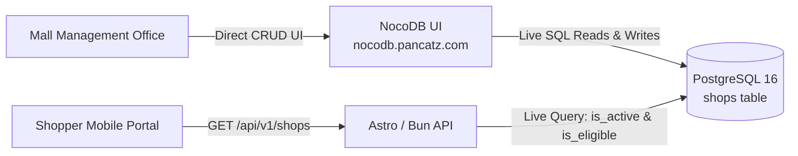

# SOP: Admin & Management Office Tenant / Shop Updates (NocoDB Linkage)

- **Initiative:** PAN-87 / PAN-75 (321 Clementi Autonomous Parking Barcode)
- **Status:** Approved Architecture & Operational Standard
- **Audience:** Mall Management Office, Customer Service Operations, Engineering
- **Database Table:** `public.shops` (PostgreSQL 16)
- **Admin UI:** NocoDB (`https://nocodb.pancatz.com`)
- **API Alternative:** `https://<domain>/api/v1/admin/shops`

---

## 1. Executive Summary

Tenant store updates for 321 Clementi (new shop additions, category updates, unit/floor changes, and promotional eligibility flags) are managed **directly via NocoDB**, connected as an administrative GUI over the PostgreSQL 16 `shops` table. 

Because the Astro / Bun application dynamically queries `shops` on every customer intake request (`GET /api/v1/shops?eligible_only=true`), any record added, edited, or disabled in NocoDB takes effect **immediately** across all customer-facing interfaces without code changes or redeployments.

---

## 2. Shop Schema & Permitted Values

The underlying PostgreSQL table is `shops`:

| Field | Type | Required | Description / Allowed Values | Example |
|---|---|---|---|---|
| `id` | UUID | Auto (PK) | Auto-generated system identifier | `a1b2c3d4-...` |
| `name` | VARCHAR(128) | Yes | Full commercial store name | `Huang Tu Di Xi'An Delights` |
| `slug` | VARCHAR(128) | Yes (Unique) | URL-safe identifier (lowercase, hyphens) | `huang-tu-di-xi-an-delights` |
| `category` | VARCHAR(64) | Yes | Mall Category: `Dine`, `Learn`, `Relax`, `Services` | `Dine` |
| `level` | VARCHAR(16) | Yes | Floor level: `B2`, `B1`, `L1`, `L2`, `L3`, `L4`, `L5`, `L6`, `L7`, `Rooftop` | `L2` |
| `unit` | VARCHAR(64) | Yes | Mall unit number format | `#02-08` |
| `is_active` | BOOLEAN | Yes | Tenant currently operating in mall | `true` |
| `is_eligible` | BOOLEAN | Yes | Receipts qualify for carpark redemption | `true` |
| `ineligibility_reason` | TEXT | If ineligible | Reason for exclusion | `Medical clinic excluded under mall policy` |
| `created_at` | TIMESTAMPTZ | Auto | Record creation timestamp | `NOW()` |
| `updated_at` | TIMESTAMPTZ | Auto | Record last modified timestamp | `NOW()` |

---

## 3. Operational Workflows in NocoDB

### 3.1 Scenario A: Onboarding a New Tenant Store
1. Log in to **NocoDB** at `https://nocodb.pancatz.com`.
2. Navigate to the **321 Clementi** base → **`shops`** table.
3. Click **Add Row / + New Record**.
4. Fill in the required fields:
   - `name`: Full store name as shown on store receipts (e.g., `Gong Cha`).
   - `slug`: Lowercase letters, numbers, and hyphens (e.g., `gong-cha`).
   - `category`: Select one of the 4 mall categories: `Dine`, `Learn`, `Relax`, `Services`.
   - `level`: Floor level (e.g., `L1`).
   - `unit`: Unit identifier (e.g., `#01-05`).
   - `is_active`: Set to `true` (checked).
   - `is_eligible`: Set to `true` (checked) if retail/F&B receipts qualify for parking vouchers.
5. Save the row. The tenant will immediately populate in the shopper dropdown selector.

### 3.2 Scenario B: Marking a Tenant as Ineligible (e.g., Clinics, Non-Retail, Excluded Services)
1. Locate the shop in NocoDB.
2. Toggle `is_eligible` to `false` (unchecked).
3. Set `ineligibility_reason` (e.g., `Excluded per Mall Promotion Terms`).
4. Keep `is_active` as `true` (if the tenant is operating) so AI receipt verification can still match and reject the receipt gracefully rather than flagging an unrecognized vendor.

### 3.3 Scenario C: Tenant Relocation or Unit Update
1. Locate the shop row in NocoDB.
2. Edit `level` or `unit`.
3. Save changes. Updated unit details are reflected on next page refresh.

### 3.4 Scenario D: Tenant Lease Expiry / Departure
1. Locate the shop row in NocoDB.
2. Toggle `is_active` to `false` (unchecked).
3. The shop is immediately hidden from the customer intake dropdown while preserving historical links in `redemption_logs`.

---

## 4. Administrative REST API (Automated Alternative)

For programmatic bulk imports or automated synchronization from mall management ERPs, the service exposes authenticated admin endpoints protected by `X-Admin-Key` or `Authorization: Bearer <ADMIN_API_KEY>`:

- **Create Shop:** `POST /api/v1/admin/shops`
- **Update Shop:** `PATCH /api/v1/admin/shops` (pass `id` + modified fields)
- **Delete Shop:** `DELETE /api/v1/admin/shops` (pass `id`)

---

## 5. Acceptance Criteria

- **AC-1 (Live Data Source):** The customer intake endpoint (`GET /api/v1/shops?eligible_only=true`) reads directly from PostgreSQL `shops`. Updates made via NocoDB appear without server restarts.
- **AC-2 (Eligibility Enforcement):** Only stores with `is_active = true` AND `is_eligible = true` appear in the customer shop dropdown.
- **AC-3 (Audit Integrity):** Existing redemption logs retain foreign key links (`shop_id`) even if a store is marked inactive or modified.
- **AC-4 (Operational Independence):** Mall management staff do not require developer intervention or git commits to manage the tenant directory.
